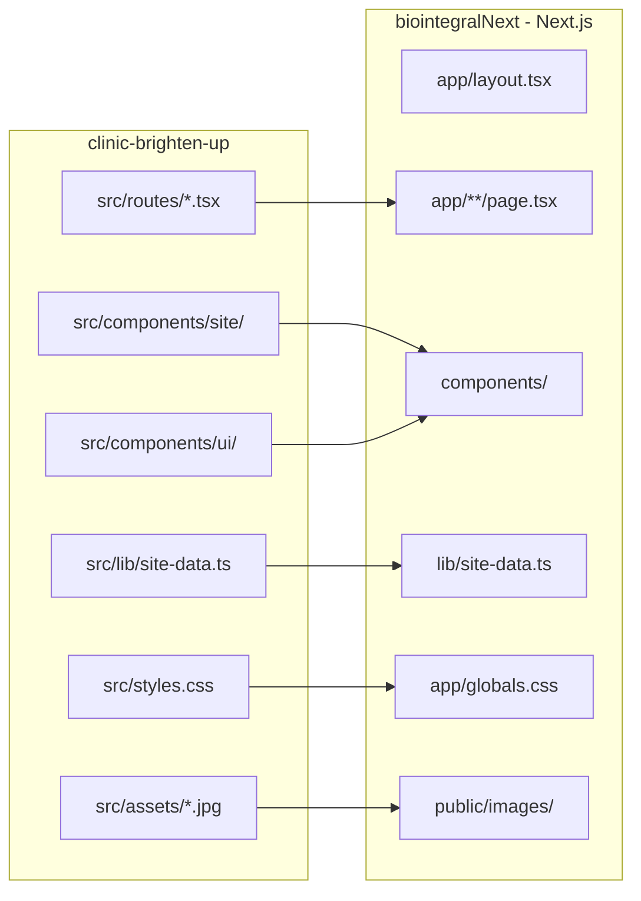

# Plano de migração: Lovable (GitHub) → Next.js + Tailwind

## Visão geral

Dois repositórios, papéis distintos:

| Repositório | Caminho local | Papel |
|-------------|---------------|-------|
| **Fonte (Lovable)** | [`../clinic-brighten-up`](../clinic-brighten-up) | Design pronto — referência visual e de código |
| **Destino (produção)** | [`biointegralNext`](.) | Site em produção — será migrado para Next.js |

- **Remote Lovable:** `git@github.com:sergiofisio/clinic-brighten-up.git`
- **Stack fonte:** TanStack Start + Tailwind v4 + shadcn/ui
- **Stack destino:** Next.js 15 (App Router) + Tailwind v4 + shadcn/ui

O clone via GitHub já está feito. Não é necessário ZIP nem pasta `lovable-export/`.

---

## Arquitetura da migração



---

## Inventário do repositório Lovable

### Rotas (7 páginas + sitemap)

| Arquivo Lovable | Rota | Destino Next.js |
|-----------------|------|-----------------|
| `src/routes/index.tsx` | `/` | `app/page.tsx` |
| `src/routes/quem-somos.tsx` | `/quem-somos` | `app/quem-somos/page.tsx` |
| `src/routes/tecnicas.$slug.tsx` | `/tecnicas/:slug` | `app/tecnicas/[slug]/page.tsx` |
| `src/routes/clinicas.tsx` | `/clinicas` | `app/clinicas/page.tsx` |
| `src/routes/contato.tsx` | `/contato` | `app/contato/page.tsx` |
| `src/routes/faq.tsx` | `/faq` | `app/faq/page.tsx` |
| `src/routes/__root.tsx` | layout global | `app/layout.tsx` |
| `src/routes/sitemap[.]xml.ts` | `/sitemap.xml` | `app/sitemap.ts` |

### Componentes do site

- `src/components/site/Nav.tsx`
- `src/components/site/Footer.tsx`
- `src/components/site/WhatsAppFloat.tsx`
- 40+ componentes shadcn em `src/components/ui/` (copiar os usados; accordion, button, form, input, textarea)

### Dados e conteúdo

- [`src/lib/site-data.ts`](../clinic-brighten-up/src/lib/site-data.ts) — clínicas Livance, técnicas, FAQ, sintomas, WhatsApp
- [`src/assets/`](../clinic-brighten-up/src/assets/) — 6 imagens JPG (hero, profissionais, técnicas)

### Design system

Tokens em [`src/styles.css`](../clinic-brighten-up/src/styles.css):

- navy `#0f172a`, gold `#c5a059`, champagne `#f1ebe4`, canvas `#fcfafb`
- Fontes: Instrument Serif + Inter
- shadcn style: `new-york`, CSS variables

---

## Fases de implementação

### Fase 0 — Preparação (concluída)

- [x] Clone do GitHub: `clinic-brighten-up`
- [ ] Confirmar número real do WhatsApp (atual: placeholder `5511999999999`)
- [ ] Decidir destino das rotas legadas: `/satisfacao`, `/livros` (manter com redirect ou remover)

### Fase 1 — Scaffold Next.js em `biointegralNext`

1. Criar app Next.js 15 com App Router e TypeScript
2. Configurar Tailwind v4 (`@tailwindcss/postcss`)
3. Inicializar shadcn/ui (`components.json` com aliases `@/`)
4. Copiar bloco `@theme` e `:root` de `clinic-brighten-up/src/styles.css` → `app/globals.css`
5. Configurar fontes com `next/font/google`:
   - `Instrument_Serif` (display)
   - `Inter` (sans)
6. Copiar `src/lib/utils.ts` (cn helper)

**Remover do legado:** Vite, React Router, `index.html`, `vite.config.ts`, `src/main.tsx`, `src/App.tsx`

### Fase 2 — Layout global

Converter `__root.tsx` → `app/layout.tsx`:

| TanStack Start | Next.js |
|--------------|---------|
| `head()` com meta array | `export const metadata: Metadata` |
| JSON-LD em `scripts` | `<script type="application/ld+json">` no layout ou componente |
| `Nav` + `Outlet` + `Footer` + `WhatsAppFloat` | children wrapper no layout |
| `QueryClientProvider` | Remover (não usado nas páginas atuais) |
| `lang="en"` | Corrigir para `lang="pt-BR"` |
| Links Google Fonts | Substituir por `next/font` |

Corrigir meta tags duplicadas/conflitantes no `__root.tsx` do Lovable (há descriptions em inglês sobrepostas).

### Fase 3 — Páginas (rota a rota)

Para cada rota Lovable:

1. Copiar JSX do componente de página
2. Trocar `createFileRoute` + `head()` → `export const metadata` ou `generateMetadata`
3. Trocar `Link` de `@tanstack/react-router` → `next/link`
4. Trocar `import img from "@/assets/..."` → `next/image` com arquivos em `public/images/`
5. Marcar `"use client"` apenas em páginas com `useState` (ex.: `/contato`)

**Home (`index.tsx`):** página mais complexa — 12 seções inline. Extrair seções para componentes em `components/sections/` conforme necessário (Hero, SymptomMarquee, TechniquesGrid, etc.).

**Técnicas dinâmicas:** `generateStaticParams` com slugs de `TECHNIQUES`.

### Fase 4 — Componentes e assets

1. Copiar `Nav.tsx`, `Footer.tsx`, `WhatsAppFloat.tsx` → `components/site/`
2. Ajustar links internos para `next/link`
3. Copiar componentes shadcn usados (accordion no FAQ, form no contato)
4. Copiar imagens para `public/images/`
5. Copiar `site-data.ts` → `lib/site-data.ts`
6. Atualizar `whatsappNumber` com número real

### Fase 5 — SEO e arquivos estáticos

| Lovable | Next.js |
|---------|---------|
| `sitemap[.]xml.ts` | `app/sitemap.ts` |
| `public/robots.txt` | `app/robots.ts` ou `public/robots.txt` |
| `head()` por rota | `metadata` por `page.tsx` |
| OG image (URL R2 Lovable) | Baixar e hospedar em `public/og.png` |

Reutilizar base URL de [`src/config/seo.ts`](src/config/seo.ts):
- `https://www.biointegralsaude.com.br`

JSON-LD a portar:
- `MedicalBusiness` no layout
- `FAQPage` em `/faq`

### Fase 6 — Formulário de contato

O Lovable envia via WhatsApp (`window.open` com mensagem formatada) — comportamento simples, sem backend.

Opções:
- **A)** Manter igual (client-side, abre WhatsApp) — mais rápido
- **B)** Integrar EmailJS (já usado no site legado em `src/components/form/contact/`)

### Fase 7 — Deploy e redirects

1. Atualizar [`vercel.json`](vercel.json) — remover rewrite SPA (`"source": "/(.*)" → /index.html`)
2. Redirects 301 se necessário:
   - `/satisfacao` → manter ou redirecionar
   - `/livros` → manter ou redirecionar
3. `next build` + validação visual contra preview Lovable
4. Domínio `biointegralsaude.com.br` na Vercel

### Fase 8 — Limpeza

- Manter `clinic-brighten-up` como referência (não deletar)
- Para sincronizar mudanças futuras do Lovable: `git pull` no repo fonte e re-portar diffs manualmente
- **Atenção:** se o Lovable continuar com sync GitHub ativo, commits no `clinic-brighten-up` podem sobrescrever — evitar editar o repo Lovable diretamente; toda customização vai para `biointegralNext`

---

## Mapeamento de conversão (referência rápida)

```typescript
// ANTES (TanStack Start)
import { createFileRoute, Link } from "@tanstack/react-router";

export const Route = createFileRoute("/faq")({
  head: () => ({
    meta: [{ title: "FAQ — Biointegral Saúde" }],
  }),
  component: FaqPage,
});

// DEPOIS (Next.js)
import type { Metadata } from "next";
import Link from "next/link";

export const metadata: Metadata = {
  title: "FAQ — Biointegral Saúde",
};

export default function FaqPage() { ... }
```

```typescript
// ANTES — imagem
import heroImg from "@/assets/hero-professionals.jpg";


// DEPOIS — next/image
import Image from "next/image";
<Image src="/images/hero-professionals.jpg" alt="..." width={1200} height={800} priority />
```

---

## O que reutilizar do site legado (`biointegralNext` atual)

| Recurso legado | Uso na migração |
|----------------|-----------------|
| [`src/config/seo.ts`](src/config/seo.ts) | Base URL e nome do site |
| [`src/components/form/contact/`](src/components/form/contact/) | Referência se optar por EmailJS |
| Textos longos das técnicas em [`src/assets/site/tecnicas/tecnicas.js`](src/assets/site/tecnicas/tecnicas.js) | Enriquecer páginas de técnica se necessário |
| [`public/sitemap.xml`](public/sitemap.xml) | Referência de URLs em produção |

**Nota:** os endereços no Lovable (3 Livance: Brigadeiro, Paulista, Santo André) substituem os do site legado (SP, São Bernardo, Brasília). Usar os dados do Lovable.

---

## Riscos e mitigações

| Risco | Mitigação |
|-------|-----------|
| TanStack Start ≠ Next.js | Conversão sistemática; não tentar rodar o código Lovable direto no Next |
| Sync bidirecional Lovable↔GitHub | Não editar `clinic-brighten-up`; migrar tudo para `biointegralNext` |
| Imagens geradas por IA | Já versionadas no repo; substituir por fotos reais depois |
| Meta tags duplicadas no Lovable | Limpar na migração para Next.js |
| Rotas legadas `/satisfacao`, `/livros` | Decisão do cliente antes do deploy |

---

## Próximo passo

Com este plano aprovado, iniciar **Fase 1** diretamente em `biointegralNext`:

1. Scaffold Next.js
2. Portar design system
3. Migrar layout + home
4. Migrar demais rotas em sequência

**Pendências do cliente:**
- Número real do WhatsApp
- Manter ou remover `/satisfacao` e `/livros`
- Fotos reais dos profissionais (opcional — substituir as atuais)
